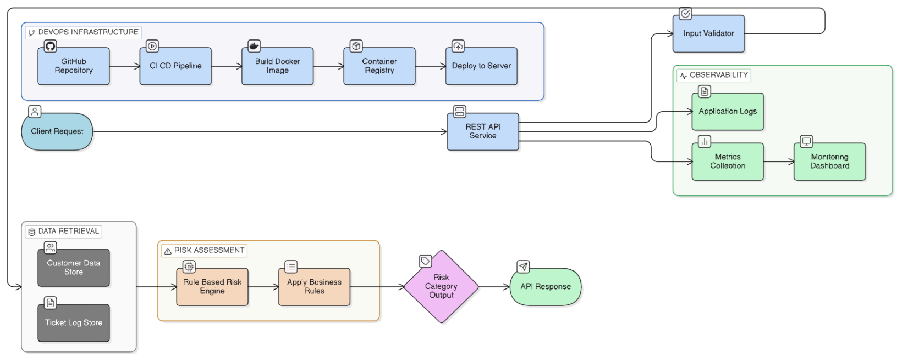

# Customer Churn Prediction System (DevOps)

## Developer Information
- Name: Vishnu Narayanan Vinodkumar  
- Roll Number: 2022BCS0001  
- Course: CSS 426 – MLOps  
- Assignment: 1 (Part 1 – DevOps)

---

## 1. Project Overview

This project implements a **rule-based customer churn prediction system** deployed using a **DevOps pipeline**.  

The system exposes a REST API that evaluates customer data and classifies churn risk into predefined categories using deterministic business rules.

Unlike machine learning systems, this implementation ensures:
- Transparent decision-making  
- Deterministic outputs  
- Ease of debugging and validation  

---

## 2. System Architecture

The overall system follows a DevOps-oriented architecture consisting of:

- Version control using GitHub  
- Continuous Integration (CI) pipeline  
- Docker-based containerization  
- API service for inference  
- Observability through logging and metrics  

### Workflow

- Code is pushed to GitHub  
- CI pipeline is triggered  
- Tests are executed  
- Docker image is built  
- Image is pushed to DockerHub  
- Service is deployed and exposed via API  



The architecture demonstrates:
- Integration of CI/CD pipeline  
- Rule-based inference engine  
- Monitoring and logging capabilities  
- Containerized deployment strategy  

---

## 3. Rule-Based Prediction Logic

The churn prediction logic is implemented in `rules.py` and is based on simple business rules:

```python
if tenure < 6 and monthly > 70:
    return "High Risk"
elif tenure < 12:
    return "Medium Risk"
else:
    return "Low Risk"