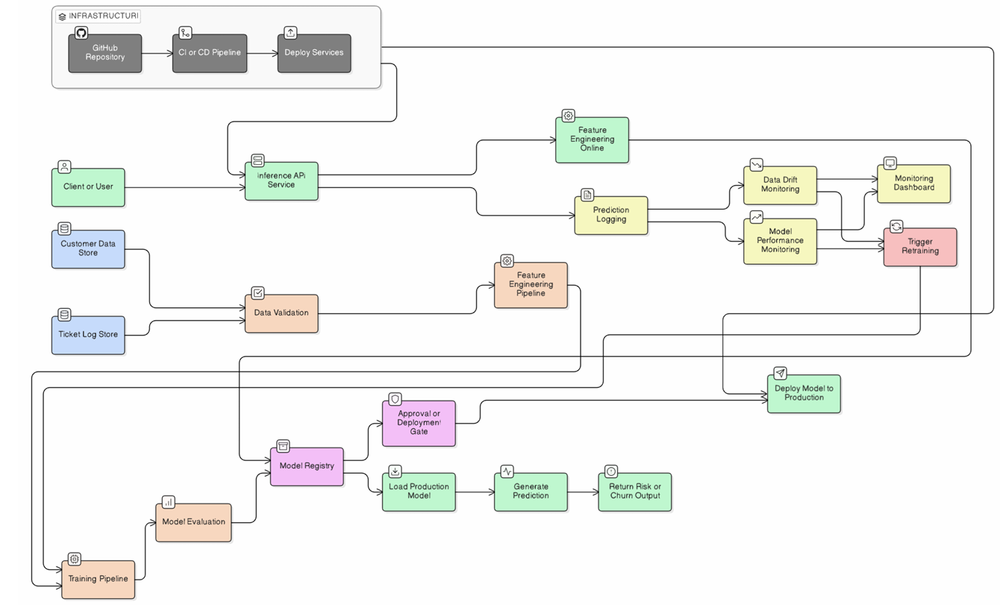

# Customer Churn Prediction System (DevOps + MLOps)

## Developer Information
- Name: Vishnu Narayanan Vinodkumar  
- Roll Number: 2022BCS0001  
- Course: CSS 426 – MLOps  
- Assignment: 1 (Part 1 & 2 Combined)

---

## 1. Project Overview

This project implements a hybrid **customer churn prediction system** combining **DevOps principles** with **MLOps workflows**.

The system exposes a REST API that offers two types of prediction:
1. **Rule-Based (DevOps)**: Deterministic business logic for transparent decision-making.
2. **ML-Based (MLOps)**: Probabilistic prediction using a Logistic Regression model trained on the Telco Customer Churn dataset.

---

## 2. System Architecture

The project integrates:
- **DevOps**: GitHub CI/CD, Pytest, Docker containerization, and DockerHub registry.
- **MLOps**: Automated model training (`datasets/train.py`), artifact management (`ml_artifacts/`), and inference pipeline.

### Workflow
- Code push triggers GitHub Actions.
- **MLOps Step**: Model is automatically retrained and validated.
- **DevOps Step**: Unit and integration tests are executed.
- **Deployment**: Docker image built (containing code + model) and pushed to DockerHub.
- **Artifacts**: A `report.yaml` is generated and uploaded as a build artifact.

---

## 3. Prediction Logic

### Rule-Based (DevOps)
Implemented in `app/rules.py`:
- **High Risk**: tenure < 6 and monthly > 70
- **Medium Risk**: tenure < 12
- **Low Risk**: Otherwise

### ML-Based (MLOps)
- **Model**: Logistic Regression
- **Data**: Telco Customer Churn (Kaggle)
- **Features**: Demographics, Services, and Billing information.

---

## 4. API Endpoints

- `POST /predict`: Rule-based prediction.
- `POST /ml_predict`: Machine learning-based prediction.
- `GET /batch_predict`: Synthetic batch prediction (Rules).
- `GET /ml_batch_predict`: Synthetic batch prediction (ML).
- `GET /dataset`: Generate synthetic customer data.
- `GET /metrics`: Prometheus metrics.
